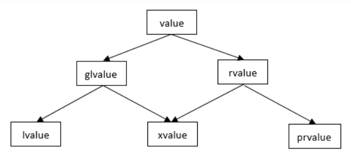

# 值类别
https://zh.cppreference.com/w/cpp/language/value_category

每个 C++ 表达式（带有操作数的操作符、字面量、变量名等）可按照两种独立的特性加以辨别：类型和值类别 (value category)。每个表达式都具有某种非引用类型，且每个表达式只属于三种基本值类别中的一种：*纯右值 (prvalue)、亡值 (xvalue)、左值 (lvalue)*。

* 泛左值 (glvalue)（“泛化 (generalized)”的左值）是求值确定一个对象、位域或函数的个体的表达式；
* 纯右值 (prvalue)（“纯 (pure)”的右值）是求值符合下列之一的表达式：
    * 计算某个运算符的操作数的值（这种纯右值没有结果对象）
    * 初始化某个对象（称这种纯右值有一个结果对象）。  
      结果对象可以是变量，由 new 表达式创建的对象，由临时量实质化创建的临时对象，或者前述三类对象的成员。注意非 void 的弃值表达式有结果对象（即被实质化的临时量）。并且在作为 decltype 的操作数以外的情况下，每个类类型或数组类型的纯右值都有结果对象；
* 亡值 (xvalue)（“将亡 (expiring)”的值）是代表它的资源能够被重新使用的对象或位域的泛左值；
* 左值 (lvalue)（如此称呼的历史原因是，左值可以在赋值表达式的左边出现）是非亡值的泛左值；
* 右值 (rvalue)（如此称呼的历史原因是，右值可以在赋值表达式的右边出现）是纯右值或者亡值。
注意：这个分类法与 C++ 标准过去的各版本相比经历了显著变更，详见下文的历史部分。

### 基本类别
#### 左值
下列表达式是*左值表达式*：

* 变量、函数、``模板形参对象 (C++20 起)``或数据成员的名字，不论类型，例如 ``std::cin`` 或 ``std::endl``。即使变量的类型是右值引用，由它的名字构成的表达式仍是左值表达式；
* 返回类型是左值引用的函数调用或重载运算符表达式，例如 ``std::getline(std::cin, str)``、``std::cout << 1``、``str1 = str2`` 或 ``++it``；
* ``a = b``，``a += b``，``a %= b``，以及所有其他内建的赋值及复合赋值表达式；
* ``++a`` 和 ``--a``，内建的前置自增与前置自减表达式；
* ``*p``，内建的间接寻址表达式；
* ``a[n]`` 和 ``n[a]``，内建的下标表达式，``当 a[n] 中的一个操作数是数组左值时 (C++11 起)``；
* ``a.m``，对象成员表达式，除了 m 是成员枚举项或非静态成员函数，或者 a 是右值而 m 是对象类型的非静态数据成员的情况；
* ``p->m``，内建的指针成员表达式，除了 m 是成员枚举项或非静态成员函数的情况；
* ``a.*mp``，对象的成员指针表达式，其中 a 是左值且 mp 是数据成员指针；
* ``p->*mp``，内建的指针的成员指针表达式，其中 mp 是数据成员指针；
* ``a, b``，内建的逗号表达式，其中 b 是左值；
* ``a ? b : c``，对某些 b 和 c 的三元条件表达式（例如，当它们都是同类型左值时，但细节见定义）；
* 字符串字面量，例如 ``"Hello, world!"``；
* 转换到左值引用类型的转型表达式，例如 ``static_cast<int&>(x)``；
* 返回类型是到函数的右值引用的函数调用表达式或重载的运算符表达式；(C++11 起)
* 转换到函数的右值引用类型的转型表达式，如 ``static_cast<void (&&)(int)>(x)``。(C++11 起)

性质：

* 与泛左值相同（见下文）。
* 可以通过内建的取址运算符取左值的地址：&++i[1] 及 &std::endl 是合法表达式。
* 可修改的左值可用作内建赋值和内建复合赋值运算符的左操作数。
* 左值可以用来初始化左值引用；这会将一个新名字关联给该表达式所标识的对象。
#### 纯右值
下列表达式是*纯右值表达式*：

* （除了字符串字面量之外的）字面量，例如 ``42``、``true`` 或 ``nullptr``；
* 返回类型是非引用的函数调用或重载运算符表达式，例如 ``str.substr(1, 2)``、``str1 + str2`` 或 ``it++``；
* ``a++`` 和 ``a--``，内建的后置自增与后置自减表达式；
* ``a + b``、``a % b``、``a & b``、``a << b``，以及其他所有内建的算术表达式；
* ``a && b``、``a || b``、``!a``，内建的逻辑表达式；
* ``a < b``、``a == b``、``a >= b`` 以及其他所有内建的比较表达式；
* ``&a``，内建的取地址表达式；
* ``a.m``，对象成员表达式，其中 m 是成员枚举项或非静态成员函数[2]，或其中 a 是右值且 m 是非引用类型的非静态数据成员 (C++11 前)；
* ``p->m``，内建的指针成员表达式，其中 m 是成员枚举项或非静态成员函数[2]；
* ``a.*mp``，对象的成员指针表达式，其中 mp 是成员函数指针[2]，或其中 a 是右值且 mp 是数据成员指针 (C++11 前)；
* ``p->*mp``，内建的指针的成员指针表达式，其中 mp 是成员函数指针[2]；
* ``a, b``，内建的逗号表达式，其中 b 是右值；
* ``a ? b : c``，对某些 b 和 c 的三元条件表达式（细节见定义）；
* 转换到非引用类型的转型表达式，例如 ``static_cast<double>(x)``、``std::string{}`` 或 ``(int)42``；
* this 指针；
* 枚举项;
* 非类型模板形参，除非它的类型是``类或 (C++20 起)``左值引用类型；
* lambda 表达式，例如 ``{ return x * x; }``；
(C++11 起)
* requires 表达式，例如 ``requires (T i) { typename T::type; }``；(C++20 起)
* 概念的特化，例如 ``std::equality_comparable<int>``。(C++20 起)

性质：

* 与右值相同（见下文）。
* 纯右值不具有多态：它所标识的对象的动态类型始终是该表达式的类型。
* 非类非数组的纯右值不能有 cv 限定，除非它被实质化以绑定到 cv 限定类型的引用 (C++17 起)。（注意：函数调用或转型表达式可能生成非类的 cv 限定类型的纯右值，但它的 cv 限定符通常被立即剥除。）
* 纯右值不能具有不完整类型（除了类型 void（见下文），或在 decltype 说明符中使用之外）
* 纯右值不能具有抽象类类型或它的数组类型。
#### 亡值
下列表达式是*亡值表达式*：

* 返回类型为对象的右值引用的函数调用或重载运算符表达式，例如 ``std::move(x)``；
* ``a[n]``，内建的下标表达式，它的操作数之一是数组右值；
* ``a.m``，对象成员表达式，其中 a 是右值且 m 是非引用类型的非静态数据成员；
* ``a.*mp``，对象的成员指针表达式，其中 a 是右值且 mp 是数据成员指针；
* ``a ? b : c``，对某些 b 和 c 的三元条件表达式（细节见定义）；
* 转换到对象的右值引用类型的转型表达式，例如 ``static_cast<char&&>(x)``；
* 在临时量实质化后，任何指代该临时对象的表达式。(C++17 起)

性质：

* 与右值相同（见下文）。
* 与泛左值相同（见下文）。

特别是，与所有的右值类似，亡值可以绑定到右值引用上，而且与所有的泛左值类似，亡值可以是多态的，而且非类的亡值可以有 cv 限定。

### 混合类别
#### 泛左值
泛左值表达式包括左值、亡值。

性质：

* 泛左值可以通过左值到右值、数组到指针或函数到指针隐式转换转换成纯右值。
* 泛左值可以是多态的：它标识的对象的动态类型不必是该表达式的静态类型。
* 泛左值可以具有不完整类型，只要表达式中容许。
#### 右值
右值表达式包括纯右值、亡值。

性质：

* 右值不能由内建的取址运算符取地址：``&int()``、``&i++[3]``、``&42`` 及 ``&std::move(x)`` 是非法的。
* 右值不能用作内建赋值运算符及内建复合赋值运算符的左操作数。
* 右值可以用来初始化 const 左值引用，这种情况下该右值所标识的对象的生存期被延长到该引用的作用域结尾。
* 右值可以用来初始化右值引用，这种情况下该右值所标识的对象的生存期被延长到该引用的作用域结尾。(C++11 起)
* 当被用作函数实参且该函数有两种重载可用，其中之一接受右值引用的形参而另一个接受 const 的左值引用的形参时，右值将被绑定到右值引用的重载之上（从而，当复制与移动构造函数均可用时，以右值实参将调用它的移动构造函数，复制和移动赋值运算符与此类似）。(C++11 起)

### 特殊类别
#### 未决成员函数调用
表达式 ``a.mf`` 与 ``p->mf``，其中 mf 是非静态成员函数，以及表达式 ``a.*pmf`` 与 ``p->*pmf``，其中 pmf 是成员函数指针，被归类为纯右值表达式，但它们不能用来初始化引用，作为函数实参，或者用于除了作为函数调用运算符的左操作数（例如 ``(p->*pmf)(args)``）以外的任何目的。

#### void 表达式
返回 ``void`` 的函数调用表达式，转换到 ``void`` 的转型表达式，以及 throw 表达式，被归类为纯右值表达式，但它们不能用来初始化引用或者作为函数实参。它们可以用在舍弃值的语境（例如自成一行，作为逗号运算符的左操作数等）和返回 ``void`` 的函数中的 ``return`` 语句中。另外，throw 表达式可用作条件运算符 ?: 的第二个和第三个操作数。

void 表达式没有结果对象。(C++17 起)
#### 位域
代表某个位域的表达式（例如 ``a.m``，其中 a 是类型 ``struct A { int m: 3; }`` 的左值）是泛左值表达式：它可用作赋值运算符的左操作数，但它不能被取地址，并且非 const 的左值引用不能绑定于它。const 左值引用或右值引用可以从位域泛左值初始化，但这会制造位域的一个临时副本：它不会直接绑定到位域。

### 历史
#### CPL
编程语言 CPL 率先为表达式引入了值类别：所有 CPL 表达式都能以“右侧模式 (right-hand mode)”求值，但只有某些类型的表达式在“左侧模式 (left-hand mode)”有意义。在右侧模式中求值时，表达式被当做一条进行值的计算（右侧值，或右值）的规则。在左侧模式中求值时，表达式的效果是给出一个地址（左侧值，或左值）。“左”和“右”代表“赋值之左”和“赋值之右”。

#### C
C 编程语言遵循相似的分类法，但赋值的作用不再重要：C 的表达式被分为“左值 (lvalue) 表达式”和其他（函数和非对象值），其中“左值 (lvalue)”的含义为标识一个对象的表达式，即“定位器值 (locator value)”[4]。

#### C++98
2011 年前的 C++ 遵循 C 模型，但恢复了对非左值表达式的“右值 (rvalue)”称呼，令函数为左值，并添加了引用能绑定到左值但唯有 const 的引用能绑定到右值的规则。几种非左值的 C 表达式在 C++ 中成为了左值表达式。

#### C++11
随着移动语义引入到 C++11 之中，值类别被重新进行了定义，以区别表达式的两种独立的性质[5]：

拥有身份 (identity)：可以确定表达式是否与另一表达式指代同一实体，例如通过比较它们所标识的对象或函数的（直接或间接获得的）地址；
可被移动：移动构造函数、移动赋值运算符或实现了移动语义的其他函数重载能够绑定于这个表达式。
C++11 中：

* 拥有身份且不可被移动的表达式被称作*左值 (lvalue)* 表达式；
* 拥有身份且可被移动的表达式被称作*亡值 (xvalue)* 表达式；
* 不拥有身份且可被移动的表达式被称作*纯右值 (prvalue)* 表达式；
* 不拥有身份且不可被移动的表达式无法使用[6]。

拥有身份的表达式被称作“泛左值 (glvalue) 表达式”。左值和亡值都是泛左值表达式。

可被移动的表达式被称作“右值 (rvalue) 表达式”。纯右值和亡值都是右值表达式。

#### C++17
C++17 中，某些场合强制要求进行复制消除，而这要求将纯右值表达式从被它们所初始化的临时对象中分离出来，这就是我们现有的系统。要注意，与 C++11 的方案相比，纯右值已不再是可被移动。