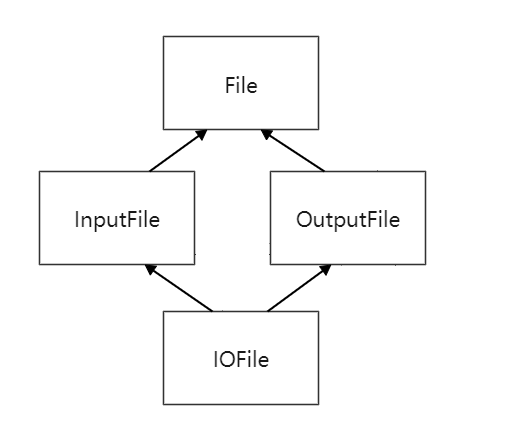
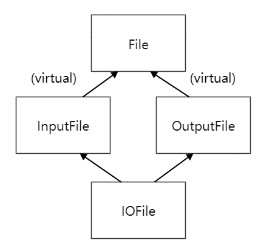

### 多重继承
多重继承(multiple inheritance:MI)，可能会产生歧义。
```c++
class BorrowableItem {
public:
    void checkOut();
    ...
};
class ElectronicGadget {
private:
    bool checkOut() const;
    ...
};
class MP3Player : public BorrowableItem, public ElectronicGadget  
{};
MP3Player mp;
mp.checkOut();
```
此例中对checkOut的调用是歧义的，即使两个函数中只有一个可用（有一个是private）。
**在看到是否有个函数可取用之前，C++首先确认这个函数对此调用而言是最佳匹配。找到最佳匹配后才检验其可取用性。**
为了解决这个歧义，必须明白地指出要调用哪一个base class 内的函数，像这样：
`mp.BorrowableItem::checkOut();`，很好。
当然也可以调用`mp.ElectronicGadget::checkOut();`，然后得到一个“尝试调用private成员函数”的错误。
### 钻石型多重继承
```c++
class File { ... };
class InputFile : public File { ... };
class OutputFile : public File { ... };
class IOFile : public InputFile, public OutputFile { ... };
```


在缺省情况下，c++会让IOFile从其每一个base class 继承一份，也就是有两个fileName成员变量。而c++也引入了virtual base class虚基类，防止同一基类成员因不同相通路线而被复制多次。
也就是采用virtual继承的方法：
```c++
class File { ... };
class InputFile : virtual public File { ... };
class OutputFile : virtual public File { ... };
class IOFile : public InputFile, public OutputFile { ... };
```


### virtual继承
不能盲目使用，virtual继承的成本：
* 使用 virtual 继承的那些 class 所产生的对象往往比使用non-virtual 继承的 class 的体积大，访问 virtual base class 的成员变量时也比访问non-virtual base class 的成员变量速度慢
* 支配"virtual base class初始化"的规则比起non-virtual base class 的情况复杂且不直观，virtual base的初始化责任是由继承体系中的最底层 class(most derived)负责，也就是说：
（1）class 若派生自 virtual base 而需要初始化，必须认知其 virtual base，不论那些base距离多远。
（2）当一个新的derived class 加入继承体系中,它必须承担其 virtual base(不论直接或间接)的初始化责任

所以，对于virtual继承有两个忠告：
* 非必要不使用 virtual base。平时要使用non-virtual继承
* 如果必须使用 virtual base class，尽可能避免在其中放置数据，这样一来就不需要担心这些 class 身上的初始化(和赋值)所带来的诡异事情了。
### public和private并存的多重继承
多重继承的一个正当用途是：**将“public继承某个Interface class”和“private继承某个协助实现的class”结合到一起**。
```c++
class IPerson {
public:
    virtual ~IPerson();
    virtual std::string name() const = 0;
    virtual std::string birthDate() const = 0;
};
class DatabaseID { …… };
class PersonInfo {
public:
    explicit PersonInfo(DatabaseID pid);
    virtual ~PersonInfo();
    virtual const char* theName() const;
    virtual const char* theBirthdayDate() const;
    ……
private:
    virtual const char* valueDelimOpen() const;
    virtual const char* valueDelimClose() const;
    ……
};
class CPerson : public IPerson, private PersonInfo {//多重继承
public:
    explicit CPerson(DatabaseID pid) : PersonInfo(pid) {}
    virtual std::string name() const  //实现必要的IPerson成员函数
    {
        return PersonInfo::theName();
    }
    virtual std::string birthDate() const  //实现必要的IPerson成员函数
    {
        return PersonInfo::theBirthDate();
    }
private:
    //重新定义继承而来的virtual“界限函数”
    const char* valueDelimOpen() const { return ""; }
    const char* valueDelimClose() const { return ""; }
};
```