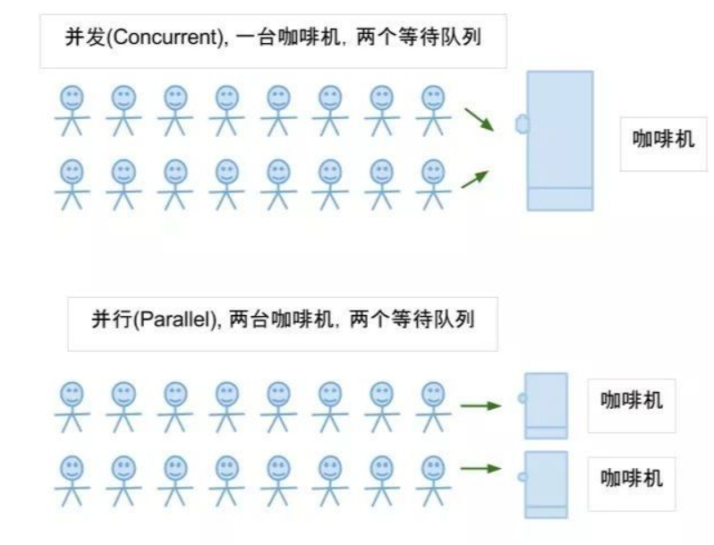

# 并发、并行
### 并发
并发（Concurrent），一个线程执行一小段时间后，被操作系统暂停，继续执行另外一个线程的一小段，多个线程轮流执行，由于 CPU 的执行效率非常高，时间片非常短，因此效果上来看就是多个线程在同时执行，这种方式叫做**并发**。
### 并行
并行（Parallel），当系统有一个以上CPU时，不同 CPU 处理不同的线程，线程间不互相抢占 CPU 资源，可以同时进行，这种方式叫做**并行**。
### 区别
并发：多个进程，每个一次执行一小段，来回切换  
并行：多个进程，在多个 CPU 上分别执行，互不影响

### 参考文献
https://blog.csdn.net/wallace_www/article/details/117792034  
https://cloud.tencent.com/developer/article/1424249