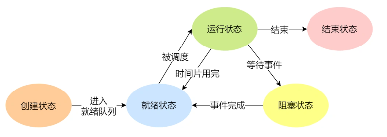
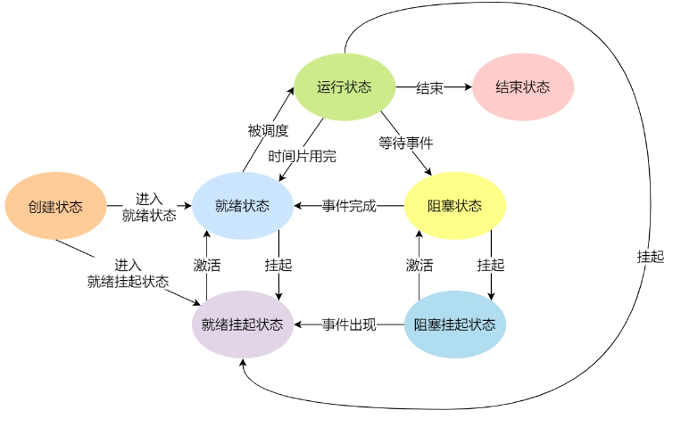

# 挂起、阻塞、睡眠
我们在[进程、线程、协程](%E8%BF%9B%E7%A8%8B%E3%80%81%E7%BA%BF%E7%A8%8B%E3%80%81%E5%8D%8F%E7%A8%8B.md)中提到过，进程的基本状态有五种：
* 初始：进程刚被创建，由于其他进程正占有CPU所以得不到执行，只能处于初始状态。
* 就绪：只有处于就绪状态的经过调度才能到执行状态
* 执行：任意时刻处于执行状态的进程只能有一个。
* 等待(阻塞)：进程等待某件事件完成
* 停止：进程结束

并没有**挂起**和**睡眠**状态，这是怎么绘世呢？

其实还存在**挂起**这种状态。
* 阻塞挂起状态：进程在外存（硬盘）并等待某个事件的出现；
* 就绪挂起状态：进程在外存（硬盘），但只要进入内存，即刻立刻运行；

因为处理器处理的速度比I/O快得多，所以可能有很多进程都处于阻塞状态（因等待读写而阻塞），导致处理器效率低。

这时便出现了**挂起**。挂起会将正在阻塞的进程换出到磁盘中挂起队列，将其他**优先级高**且正在**就绪**状态的进程换到内存中运行。  
就绪状态也可能被换出，换成更高优先级。但是一般不会发生，因为阻塞的进程太多了，当然要有限换出阻塞的进程。

至于**睡眠**，睡眠是应用主动选择的，睡眠一定时间，期间是**阻塞态**，到一定时间后则恢复到**就绪态**。  
当一个进程获取资源比如获取最普通的锁而失败后，可以选择[忙等待和让权等待]()。忙等待会一直处在运行态，而让权等待一般指的就是**睡眠**。
## 参考
https://www.cnblogs.com/ck1020/p/6669661.html  
https://zhuanlan.zhihu.com/p/500264526  
https://www.zhihu.com/question/42962803  
https://xiaolincoding.com/os/4_process/process_base.html#%E8%BF%9B%E7%A8%8B%E7%9A%84%E7%8A%B6%E6%80%81