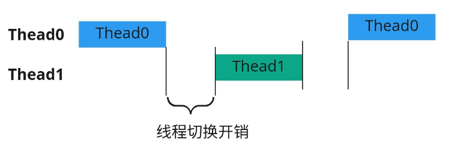

# 进程、线程、协程
### 进程（process）
进程是一个抽象的概念，官方定义是：进程是一个具有一定独立功能的程序在一个数据集上的一次动态执行的过程，**是操作系统进行资源分配的最小单位**，由程序、数据集合和进程控制块三部分组成。

操作系统通过**进程控制块 (PCB，Processing Control Block)** 来实现对进程的控制和管理，一个进程常见的基本状态有五种：

* 初始：进程刚被创建，由于其他进程正占有CPU所以得不到执行，只能处于初始状态。
* 就绪：只有处于就绪状态的经过调度才能到执行状态
* 执行：任意时刻处于执行状态的进程只能有一个。
* 等待(阻塞)：进程等待某件事件完成
* 停止：进程结束

一个执行中的程序就是一个进程，进程负责独立的功能，占据独立的内存，互不影响，CPU 控制权在不同进程之间交换的机制成为上下文切换 (context switch)。

进程之间通过管道、消息队列、信号量机制、共享内存、套接字等方式进行通信。

多进程是在操作系统层面进行并发的基本模式，由于每个进程有自己独立的内存空间，所以相对稳定安全，但是进程的切换开销较大，因此并不是一种良好的并发模型。
### 线程（thread）
一个进程可以有多个线程，多个线程共享进程的内存空间，**线程是程序执行流的最小单元，是处理器调度和分派的基本单位**，一个标准的线程由线程ID、当前指令指针(PC)、寄存器和堆栈组成。

多线程程序中至少有一个主线程，通常为 main 函数所在的线程，所有线程都是它的子线程，当主线程终止时，资源被释放，所有子线程也同时结束。

跟进程类似，操作系统管理线程的控制块为 **TCB(Thread Control Block)**，在单核处理器中，比较常见的线程调度方式是**时间片轮转法**来进行**抢占式进程调度**，一个线程执行一小段时间后，被操作系统暂停，继续执行另外一个线程的一小段，多个线程轮流执行，由于 CPU 的执行效率非常高，时间片非常短，因此效果上来看就是多个线程在同时执行，这种方式叫做**并发**；在多核处理器中，不同 CPU 处理不同的线程，线程间不互相抢占 CPU 资源，这种方式叫做**并行**。  
关于[并发和并行](/OS/并发、并行.md)
### 协程（coroutine）
协程（Coroutines）是一种比线程更加轻量级的存在。协程完全由程序所控制（在用户态执行），带来的好处是性能大幅度的提升。一个线程可以有多个协程。

一个线程内的多个协程的运行是**串行**的，这点和多进程（多线程）在多核CPU上执行时是不同的。 多进程（多线程）在多核CPU上是可以并行的。**当线程内的某一个协程运行时，其它协程必须挂起。**

由于，涉及到的资源比较少。不像内核级线程（进程）切换那样，上下文的内容比较多，切换代价较大。协程本身是非常轻巧的，可以简单理解为只是切换了寄存器和协程栈的内容。这样代价就非常小。

**线程切换**

**协程切换是在线程内完成的**，协程并没有增加线程数量，只是在线程的基础之上通过分时复用的方式运行多个协程，而且协程的切换在用户态完成，切换的代价比线程从用户态到内核态的代价小很多。

**协程就是把原来每个线程分别负责的任务压缩到少量线程中，每个线程中用协程来实现原来线程级别的任务，因为包装了系统io导致协程内遇到io不会导致当前线程被挂起，以起到最大化利用时间片，减少线程调度开销的作用。**
### 总结
||进程|线程|协程|
|---|---|---|---|
|定义|操作系统**资源分配**的最小单位|操作系统**任务调度**的最小单位|**用户态**的轻量级线程，内核不可见|
|资源共享|有独立的内存空间|同一进程间的线程共享内存|共享线程的内存，拥有独立的寄存器上下文和栈|
|切换开销|开销大|内核态切换，开销小|用户态切换，无需上下文切换，开销极小|
|数据同步|进程间通信|用锁等机制确保数据的一致性和可见性|控制共享资源不加锁，只需判断状态，效率高|
|调用机制|同步|同步|异步|

### 参考文献
https://blog.csdn.net/wallace_www/article/details/117792034  
https://blog.csdn.net/kuangsonghan/article/details/80674777  
https://zhuanlan.zhihu.com/p/172471249  
https://cloud.tencent.com/developer/article/1916705