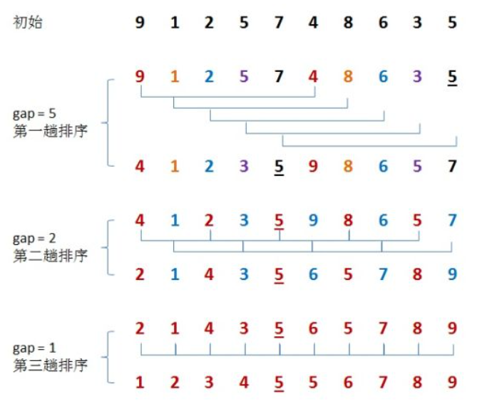

# 希尔排序 shellSort
### 性能
* 平均时间复杂度：O(nlogn)
* 最差时间复杂度：O(n2)
* 空间复杂度：O(1)
* 稳定性：不稳定
* 复杂性：较复杂
### 逻辑
希尔排序是插入排序的优化。  
希尔排序先取一个小于 n 的数作为增量 gap ，然后分组，间隔 gap 的所有元素为一个组，这样可以将数组分为 gap 个组，之后对每组做插入排序。  
之后不断缩小 gap ，继续对各组做插入排序。直到 gap 为 1 （当前分组为整个数组），排序完毕。



gap 值的选取会影响希尔排序的效率，所以时间复杂度不是一个定值。  
开始时， gap 取值较大，子序列中的元素较少，排序速度快，克服了直接插入排序的缺点；其次， gap 值逐渐变小后，虽然子序列的元素逐渐变多，但大多元素已基本有序，所以继承了直接插入排序的优点，能以近线性的速度排好序。  
一般情况下， gap 为 n 的一半，后续缩小也缩小为原来的一半。但这不是性能最好的办法，很深奥，to be continued~
### 代码
```cpp
vector<int> sortArray(vector<int>& nums) {
  int gap, i, j;
  int len = nums.size();
  int temp;
  for (gap = len >> 1; gap > 0; gap >>= 1) {
    for (i = gap; i < len; i++) {
      temp = nums[i];
      for (j = i - gap; j >= 0 && nums[j] > temp; j -= gap) {
        nums[j + gap] = nums[j];
      }
      nums[j + gap] = temp;
    }
  }
  return nums;
}
```
golang版本
```go
func sortArray(nums []int) []int {
	for gap := len(nums) >> 1; gap > 0; gap >>= 1 {
		for index := gap; index < len(nums); index++ {
			currentValue := nums[index]
			pendingIndex := index - gap
			for pendingIndex >= 0 && nums[pendingIndex] > currentValue {
				nums[pendingIndex+gap] = nums[pendingIndex]
				pendingIndex -= gap
			}
			nums[pendingIndex+gap] = currentValue
		}
	}
	return nums
}
```