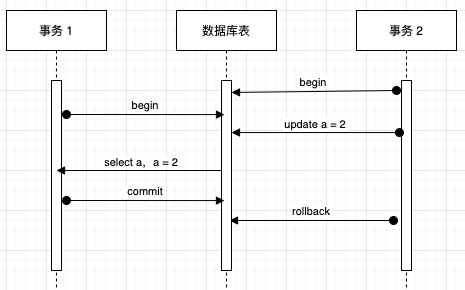
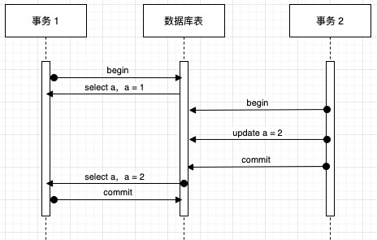
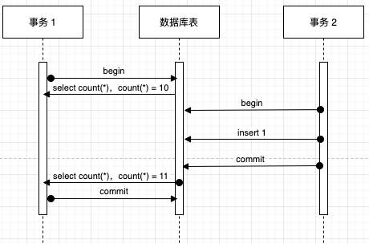
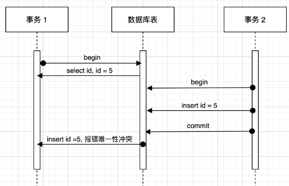
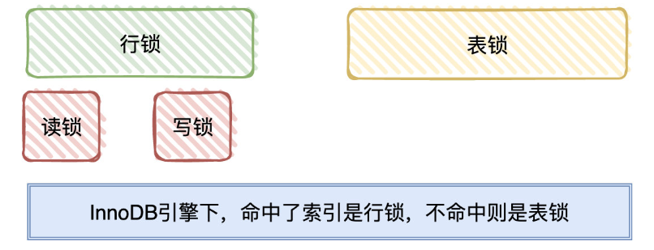
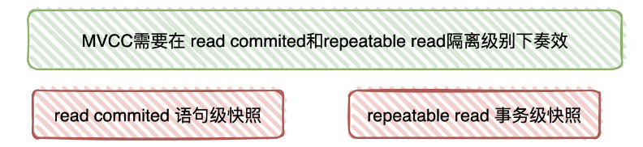

# MySQL事务、锁、MVCC
## 事务
### ACID特性
* Atomicity **原子性**: 一个事务是一个不可分割的最小单位，事务中的所有操作要么全部成功，要么全部失败，没有中间状态。原子性主要是通过事务日志中的**回滚日志(undo log)** 来实现的，当事务对数据库进行修改时，InnoDB 会根据操作生成相反操作的 undo log，比如说对 insert 操作，会生成 delete 记录，如果事务执行失败或者调用了 rollback，就会根据 undo log 的内容恢复到执行之前的状态。
* Consistency **一致性**: 事务执行之前和执行之后数据都是合法的一致性状态，即使发生了异常，也不会因为异常引而破坏数据库的完整性约束，比如唯一性约束等。**一致性是我们使用事务的目的，其他三个是保障一致性的手段。**
* Isolation **隔离性**: 每个事务是彼此独立的，不会受到其他事务的执行影响。隔离性通过**事务的隔离级别**来定义，并用**锁机制来保证写操作的隔离性**，用 **MVCC 来保证读操作的隔离性**，将在下文详细介绍。
* Durability **持久性**: 事务提交之后对数据的修改是持久性的，即使数据库宕机也不会丢失，通过事务日志中的**重做日志(redo log)** 来保证。事务修改之前，会先把变更信息预写到 redo log 中，如果数据库宕机，恢复后会读取 redo log 中的记录来恢复数据。
## 事务并发异常
在实际产线环境下，可能会存在大规模并发请求的情况，如果没有妥善的设置事务的隔离级别，就可能导致一些异常情况的出现，最常见的几种异常为`脏读(Dirty Read)`、`幻读(Phantom Read)`和`不可重复读(Unrepeatable Read)`。
### 脏读
脏读指一个事务访问到了另一个事务未提交的数据，如下过程:
1. 假设 a 的值为 1，事务 2 把 a 改为 2，此时事务还未提交
1. 在这个时候，事务 1 读取 a，读得 a 的值为 2，事务 1 读取完成
1. 结果事务 2 回滚了对 a 的修改（或者是未 commit），于是 a 的值变回 1
1. 这就导致事实上 a 的值为 1，但是事务 1 取得的结果为 2，所以事务 1 读到了脏数据，发生脏读

### 不可重复读
不可重复读指一个事务多次读取同一数据的过程中，数据值 内容 发生了改变，导致没有办法读到相同的值，描述的是针对同一条数据 update/delete 的现象，如下过程
1. 事务 1 读取 a，此时 a = 1
1. 此时事务 2 将 a 修改为 2，并成功提交，改动生效
1. 事务 1 又一次读取 a，此时 a = 2
1. 事务 1 在同一个事务里面两次读取同一个值，数据值内容却发生了改变，发生不可重复读

### 幻读
幻读指一个事务多次读取同一数据的过程中，全局数据（如数据行数）发生了改变，仿佛产生了幻觉，描述的是针对全表 insert/delete 的现象，如下过程：
1. 事务 1 第一次读取数量，得到 10 条数据
1. 此时事务 2 插入了一条数据并成功提交，改动生效，数据变成 11 条
1. 事务 1 再次读取数量，得到 11 条数据，对事务 1 而言莫名其妙的多了一条，好像产生幻觉了一样，发生幻读

或者是另一种场景，比如对于有唯一性约束的字段（如 id），发生如下过程：
1. 事务 1 要插入 id = 5 的记录，先查询数据库，发现不存在 id = 5 的数据，可以正常插入。
1. 这时候事务 2 插入了一条数据 id = 5。
1. 事务 1 插入 id = 5 时，发现报错唯一性冲突，对事务 1 来讲就好像见了鬼了，我刚刚明明检查过没有，怎么这时候又有了。

## 隔离级别
串行化的事务处理方式当然是最安全的，但是串行无法满足数据库高并发访问的需求，作为妥协，有时不得不降低数据库的隔离标准来换取事务的并发能力，通过在可控的范围内牺牲正确性来换取效率的提升，这种权衡通过事务的隔离级别来实现。

数据库有 4 种事务隔离级别，由低到高依次为 `读未提交 Read Uncommitted` 、`读已提交 Read Committed` 、`可重复读 Repeatable Read` 、`串行化 Serializable` 。

1. 读未提交 Read Uncommitted  
允许读取未提交的内容，这种级别下的查询不会加锁，因此脏读、不可重复读、幻读都有可能发生。
1. 读已提交 Read Committed  
只允许读取已提交的内容，这种级别下的查询不会发生脏读，因为脏数据属于未提交的数据，所以不会被读取，但是依然有可能发生不可重复读和幻读。
1. 可重复读 Repeatable Read （MySQL 的默认隔离级别）  
使用行级锁来保证一个事务在相同查询条件下两次查询得到的数据结果一致，可以避免脏读和不可重复读，但是没有办法避免幻读。  
需要特殊注意的是，Innodb 在 Repeatable Read 下通过 MVCC 提供了稳定的视图，因此 Innodb 的 RR 隔离级别下是不会出现上述幻读异常中的第一个场景的，但第二个场景还是会出现。
1. 串行化 Serializable  
使用表级锁来保证所有事务的串行化，可以防止所有的异常情况，但是牺牲了系统的并发性。

| |脏读|不可重复读|幻读|
| :--: | :--: | :--: | :--: |
|读未提交 Read Uncommitted|✅|✅|✅|
|读已提交 Read Committed|❌|	✅|✅|
|可重复读 Repeatable Read|❌|❌|✅|
|串行化 Serializable|❌|❌|❌|
## 锁
在InnoDB引擎下，按锁的粒度分类，可以简单分为**行锁**和**表锁**。
* 当SQL命中了索引，那锁住的就是命中条件内的索引节点（行锁）
* 如果没有命中索引，那锁的就是整个索引树（表锁）。

行锁可以分为**读锁**（共享锁、S锁）和**写锁**（排它锁、X锁）。
* 读锁是共享的，多个事务可以同时读取同一个资源，但不允许其他事务修改。
* 写锁是排他的，写锁会阻塞其他的写锁和读锁。

## MVCC
MVCC(Multi-Version Concurrency Control)多版本并发控制

通过快照机制来保证一致性读取。
* 针对于 read commit (读已提交)，它生成的就是**语句级**快照
* 针对于 repeatable read (可重复读)，它生成的就是**事务级**的快照。

MVCC通过 readview来实现（待补充）
https://blog.csdn.net/thesprit/article/details/112970122
## 参考
https://blog.csdn.net/wallace_www/article/details/118768540  
http://javainterview.gitee.io/luffy/2021/08/19/08-MySQL/02.%20MySQL%E4%BA%8B%E5%8A%A1%E5%92%8C%E9%94%81%E6%9C%BA%E5%88%B6%E5%92%8CMVCC/  
https://www.cnblogs.com/jmliao/p/13204946.html