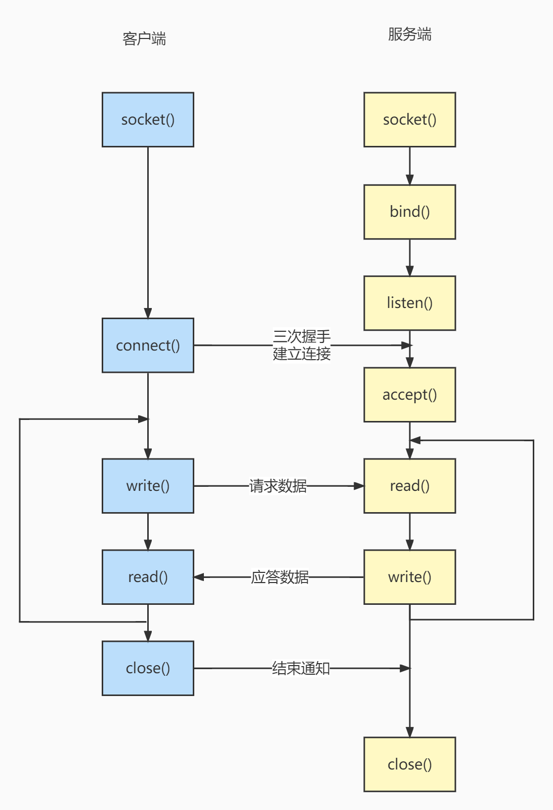

# socket
## 简介
socket 翻译为套接字，有插口的意思，在客户端和服务端进行网络通信之前，双方都需要先建立一个 socket ，在读取和发送数据的时候都通过socket来进行通讯。
## 调用过程
下图为 TCP 协议的 socket 程序的调用过程的过程：

### socket()
socket 创建的时候可以指定网络层使用 IPv4 或者 IPv6 ，传输层使用 TCP 或 UDP 。
### bind()
socket 创建之后使用 `bind()` 函数来绑定一个IP地址和端口。通过**IP地址**来找到想要通信的主机（网卡）地址，通过**端口号**来找到对应的应用程序进行数据传输。
### listen()
绑定完之后，就可以调用 `listen()` 函数进行监听。
可以通过 `netstat` 命令查看对应的端口号是否有被监听。另外需要注意防火墙的设置。  
`listen()` 函数不会阻塞，它主要做的事情为，将该**套接字**和**套接字对应的连接队列长度**告诉 Linux 内核，然后，`listen()`函数就结束。  
只要 TCP 服务器调用了 `listen()`，客户端就可以通过 `connect()` 和服务器建立连接，而这个连接的过程是由内核完成。

关于**连接队列**，服务器的内核实际上为每个 socket 维护了两个队列：
* 一个是还没完全建立连接的队列，称为 **TCP 半连接队列**，这个队列都是没有完成三次握手的连接，此时服务端处于 `syn_rcvd` 的状态；
* 一个是一件建立连接的队列，称为 **TCP 全连接队列**，这个队列都是完成了三次握手的连接，此时服务端处于 `established` 状态；
### accept()
服务端进入了监听状态后，通过调用 `accept()` 函数，来**从内核获取**客户端的连接。  
* 当 TCP 全连接队列不为空时，就会从内核中的 TCP 全连接队列里拿出一个已经完成连接的 socket 返回应用程序，后续数据传输都用这个 socket。  
* 如果为空，则会**阻塞**等待客户端连接的到来。
  
注意，监听的 socket 和真正用来传数据的 socket 是两个：
* 一个叫作**监听 socket**；
* 一个叫作**已连接 socket**；

区别见下文~
### connect()
客户端在创建好 socket 后，调用 `connect()` 函数发起连接，该函数的参数要指明服务端的 IP 地址和端口号，然后就开始了 TCP 三次握手。  
这个连接的过程是由内核完成，不是这个函数完成的，这个函数的作用仅仅是通知 Linux 内核，让 Linux 内核自动完成 TCP 三次握手连接，最后把连接的结果返回给这个函数的返回值。（成功连接为0， 失败为-1）  
通常的情况，客户端的 `connect()` 函数**默认**会一直阻塞，直到三次握手成功或超时失败才返回。可以设置为非阻塞。
### read() 、 write()
连接建立后，双方都可以通过 `read()` 和 `write()` 函数来读写数据。
## 监听 socket 和 已连接 socket
### 服务端
* 监听socket ： { * ，* ，本机 IP，本机端口 }
* 已连接socket ： { 对端 IP，对端端口，本机 IP，本机端口 }

调用 `listen()` 后，内核会把在收到连接请求后把**监听socket**变成**已连接socket**，并且放入连接队列中。  
之后 监听socket 继续监听，（全连接队列中的）已连接socket 被 `accept()` 拿走后交由应用程序处理。

### 为什么会有了监听socket还需要建立已连接socket
避免建立 **{ 本机 IP，本机端口 } : { 对端 IP，对端端口 }** 这种1对多的数据结构，处理起来更复杂。
### 参考文献
https://blog.csdn.net/tennysonsky/article/details/45621341  
https://xiaolincoding.com/os/8_network_system/selete_poll_epoll.html#%E6%9C%80%E5%9F%BA%E6%9C%AC%E7%9A%84-socket-%E6%A8%A1%E5%9E%8B  
https://www.cnblogs.com/wftop1/p/15791858.html