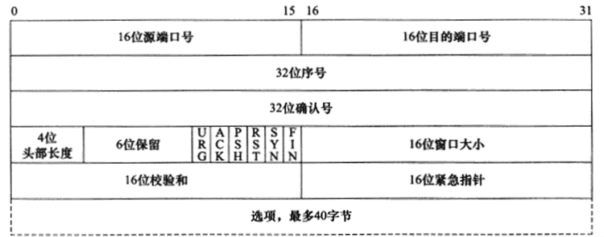

# TCP报文头部

### 16位端口号（port number）
告知主机该报文段是来自哪里（源端口）以及传给哪个上层协议或应用程序（目的端口）的。**进行TCP通信时，客户端通常使用系统自动选择的临时端口号，而服务器则使用知名服务端口号。**
### 32位序号（sequence number）
一次TCP通信（从TCP连接建立到断开）过程中某一个传输方向上的字节流的每个字节的编号。假设主机A和主机B进行TCP通信，A发送给B的第一个TCP报文段中，序号值被系统**初始化为某个随机值ISN**（Initial SequenceNumber，初始序号值）。那么在该传输方向上（从A到B），**后续的TCP报文段中序号值**将被系统设置成ISN加上该报文段所携带数据的第一个字节在整个字节流中的**偏移**。例如，某个TCP报文段传送的数据是字节流中的第1025～2048字节，那么该报文段的序号值就是ISN＋1025。另外一个传输方向（从B到A）的TCP报文段的序号值也具有相同的含义。
### 32位确认号（acknowledgement number）
用作对另一方发送来的TCP报文段的响应。其值是**收到的TCP报文段的序号值加1**。假设主机A和主机B进行TCP通信，那么A发送出的TCP报文段不仅携带自己的序号，而且包含对B发送来的TCP报文段的确认号。反之，B发送出的TCP报文段也同时携带自己的序号和对A发送来的报文段的确认号。
### 4位头部长度（header length）
标识该TCP头部有多少个32bit字（4字节）。因为4位最大能表示15，所以TCP头部最长是60字节。
### 6位标志位包含如下几项：
* URG标志，表示紧急指针（urgent pointer）是否有效。
* **ACK标志**，该位为 1 时，「确认应答」的字段变为有效，TCP 规定除了最初建立连接时的 SYN 包之外该位必须设置为 1 。我们称携带ACK标志的TCP报文段为确认报文段。
* PSH标志，提示接收端应用程序应该立即从TCP接收缓冲区中读走数据，为接收后续数据腾出空间（如果应用程序不将接收到的数据读走，它们就会一直停留在TCP接收缓冲区中）。
* **RST标志**，该位为 1 时，表示 TCP 连接中出现异常必须强制断开连接。我们称携带RST标志的TCP报文段为复位报文段。
* **SYN标志**，该位为 1 时，表示希望建立连接，并在其「序列号」的字段进行序列号初始值的设定。我们称携带SYN标志的TCP报文段为同步报文段。
* **FIN标志**，该位为 1 时，表示今后不会再有数据发送，希望断开连接。当通信结束希望断开连接时，通信双方的主机之间就可以相互交换 FIN 位为 1 的 TCP 段。我们称携带FIN标志的TCP报文段为结束报文段。
### 16位窗口大小（window size）
是TCP流量控制的一个手段。这里说的窗口，指的是接收通告窗口（Receiver Window，RWND）。它告诉对方本端的TCP接收缓冲区还能容纳多少字节的数据，这样对方就可以控制发送数据的速度。
### 16位校验和（TCP checksum）
由发送端填充，接收端对TCP报文段执行CRC算法以检验TCP报文段在传输过程中是否损坏。注意，这个校验不仅包括TCP头部，也包括数据部分。这也是TCP可靠传输的一个重要保障。
### 16位紧急指针（urgent pointer）
是一个正的偏移量。它和序号字段的值相加表示最后一个紧急数据的下一字节的序号。因此，确切地说，这个字段是紧急指针相对当前序号的偏移，不妨称之为紧急偏移。TCP的紧急指针是发送端向接收端发送紧急数据的方法。