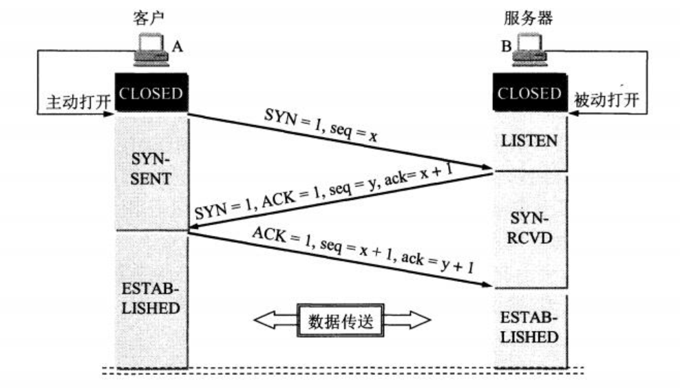

# 三次握手-为什么不是两次握手

**第三次握手时为了防止已失效的 连接请求报文段 传送到服务端，因而产生错误。**  
现假定出现一种异常情况，即A发出的第一个请求连接报文段发生了**网络延迟**，没有连接成功，于是A又重新发送了一次请求连接报文，后来收到了确认，建立了连接。后来，连接释放以后的某个时间，第一个网络延迟的请求连接报文到达了B。本来这是一个已失效的报文段，但B收到此失效的连接请求报文段后，就误认为是A又发出一次新的连接请求。于是就向A发出确认报文段，同意建立连接。**假定不采用三次握手，那么只要B发出确认，新的连接就建立了。** B会一直等待A传输数据，造成了浪费。